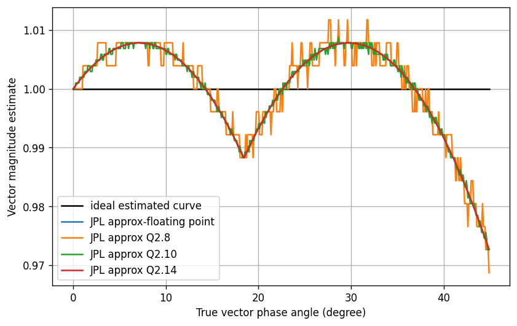
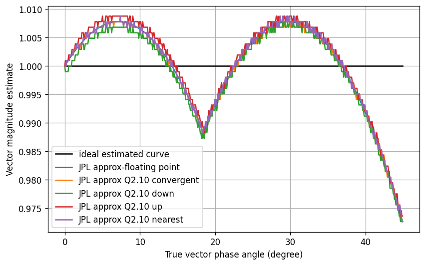

Chisel Generator of Complex Number Magnitude and its Logarithm
=======================================================

## Overview

This repository contains Chisel design generator of complex number magnitude based on JPL approximation and its binary logarithm. A [JPL approximation](https://ipnpr.jpl.nasa.gov/progress_report/42-40/40L.PDF) is a kind of "alpha max plus beta min" algorithm that can enable high-speed calculation of magnitude both in software and hardware. This method requires only adders and shifters for its implementation therefore, it is particularly suitable for hardware implementations. For calculating log2 a traditional approach based on Look-Up Table (LUT) is employed. A LUT is filled with predefined values and appropriately addressed during the logarithm calculation.
Beside magnitude and log2(magnitude), generator supports an optional squared magnitude block. A block diagram of this Chisel generator featuring a fully streaming interface and a variety of parametrization options is presented in figure below.

The design is mostly described with following Scala files available inside`src/main/scala` directory:

* `LogMagMuxTypes.scala` - contains description of all  `MagTypes` supported in the design.
* `LogMagMuxGenerator.scala`- contains parameters and interface definition. Furthermore this file has a top level design that checks generator parameters and instantiate  adequate `MagType` .
* `MagBlock.scala`, `LogMagMuxDspBlock.scala`, `AXI4StreamMultipleSimpleMagBlocks`- are different modules wrapped as `LazyModules` or `DspBlocks` featuring input/output AXI4-stream interface and optional memory-mapped bus (AXI4. APB, AHB, TileLink) for control registers. The latter file contains arbitrarily number of the same magnitude instances, suitable for multiple channels support.

## Native interface of the generator
Input/output data interface is actually handshaking Chisel’s decoupled IO interface that consists of ready/valid signals wrapped around inout data. The generator instances support fully streaming processing, meaning that designs can be constantly fed with an input stream with no waiting between two consecutive input sets.

<!---
Deprecated
For the design where pipeline registers are not used, simple passthrough logic for ready and valid signals is applied. When pipeline registers are included then additional Queues are instatiated at the output of the multiplexer. Simple [Queue](https://www.chisel-lang.org/api/latest/chisel3/util/Queue$.html) modules provide that all data will be processed and interpreted in the correct way. Module LogMagMux is ready to accept new data when ready signal from the output side is not asserted but only specific number of data, equal to the total latency of the design, can be processed (this feature is controled with `initialInDone` signal). When flushing is active, ready signal from the input side is deasserted (signal `last` denotes whether flushing is active or not). If initialization is finished (`initialInDone` is equal to true) and flushing is not active (`last` is false) then ready signal from the input side is equal to the ready signal from the output side.
-->

####  Inputs

[Decoupled](https://github.com/freechipsproject/chisel3/wiki/Interfaces-Bulk-Connections) interface is used where .bits is the input complex IQ sample.
* `in: Flipped(Decoupled(DspComplex[T]))`
* `sel: UInt(2.W)` - optional selection signal used to control data stream sent to the output
* `lastIn: Bool`- optional signal that denotes the last sample of the streaming input data

#### Outputs

A decoupled interface is used where .bits is the magnitude, log2(magnitude) or squared magnitude of the input complex number.
* `out: Decoupled([T])`
* `lastOut: Bool` - an optional signal, denotes the last sample of the streaming output (it is the delayed version of the `lastIn` signal)

## Parameter settings

Design parameters are defined inside the ` case class MAGParams` given below. An explanation of each parameter is available in the comment column.

    sealed trait MagType
    case object MagJPL extends MagType
    case object MagJPLandSqrMag extends MagType
    case object LogMag extends MagType
    case object MagJPLandLogMag extends MagType
    case object LogMagMux extends MagType

    case class MAGParams[T <: Data](
      val protoIn:         T,                     // type of the I/Q components of the input complex data
      val protoOut:        T,                     // output data type
      val protoLog:        Option[T] = None,      // data type of the log2(magnitude)
      val magType:         MagType = LogMagMux,   // define magnitude type
      val log2LookUpWidth: Int = 16,              // define the address bitwidth for the look-up table
      val useLast:         Boolean = true,        // enable or disable lastIn and lastOut AXI4-stream signals
      val numAddPipes:     Int = 1,               // number of pipeline registers added after + operation
      val numMulPipes:     Int = 1,               // number of pipeline registers added after * operation
      val binPointGrowth:  Int = 0,               // defines binary point growth logic for squared magnitude computation
      val trimType:        TrimType = RoundHalfUp // specifies how operations like multiplication, trim binary, and div2 should round results (RoundHalfUp or better known as neareast)
    ) {
      }

The number of pipeline registers defines the latency of the particular generator instance.  Control logic inside the design is adjusted to adequately follow pipeline register insertion.

A simple demonstration of how different configurations of the parameters influence the magnitude precision is given in the following figures. The first one presents magnitude estimation for different input data bitwidths, and the second presents magnitude estimation for several rounding methods.

## Tests

Simple tests that confirm the correct behavior of the proposed design are available inside this repository as well. Tests are described in the following files:

* `LogMagMuxTester` - contains a tester that drives input signals and compares the resulting data stream with expected values
* `LogMagMuxSpec` - run tester for particular parameter configurations

Tester functions such as `peek`, `poke` and `except`, available inside `DspTester` (check [dsptools Chisel library ](http://github.com/ucb-bar/dsptools)), are extensively used for design testing.

## Additional notes
Scalafmt code formatter for Scala is used for formatting Chisel code with coding rules defined inside `scalafmt.conf`.

## TODO

* Check the influence of the "trimType` and `binaryGrowth` parameter configurations on squared magnitude calculation precision.
* Analyze the impact of the LUT table size on `log2` calculation precision.
